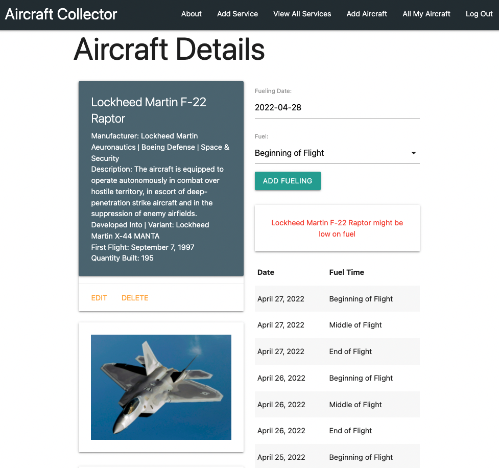
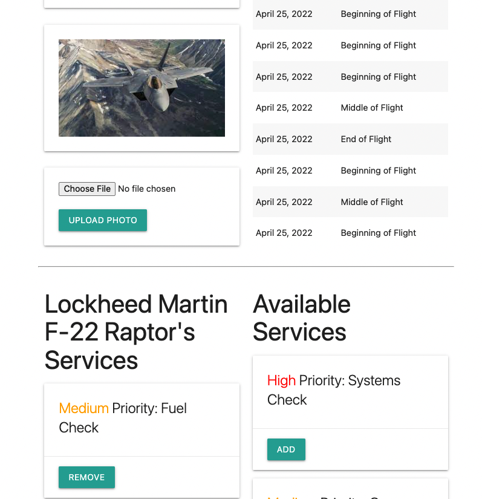
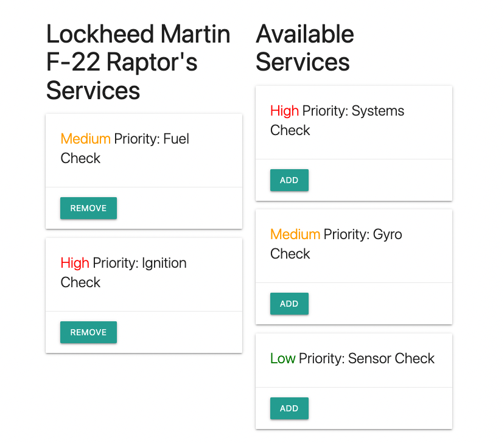
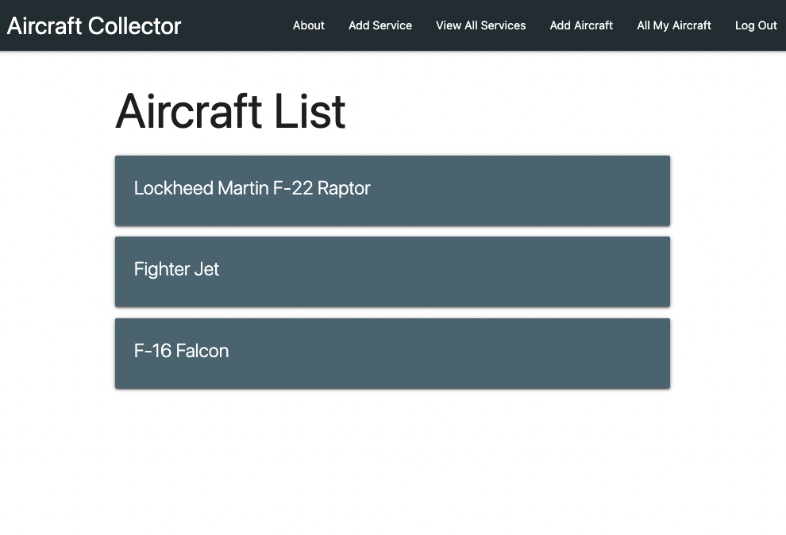
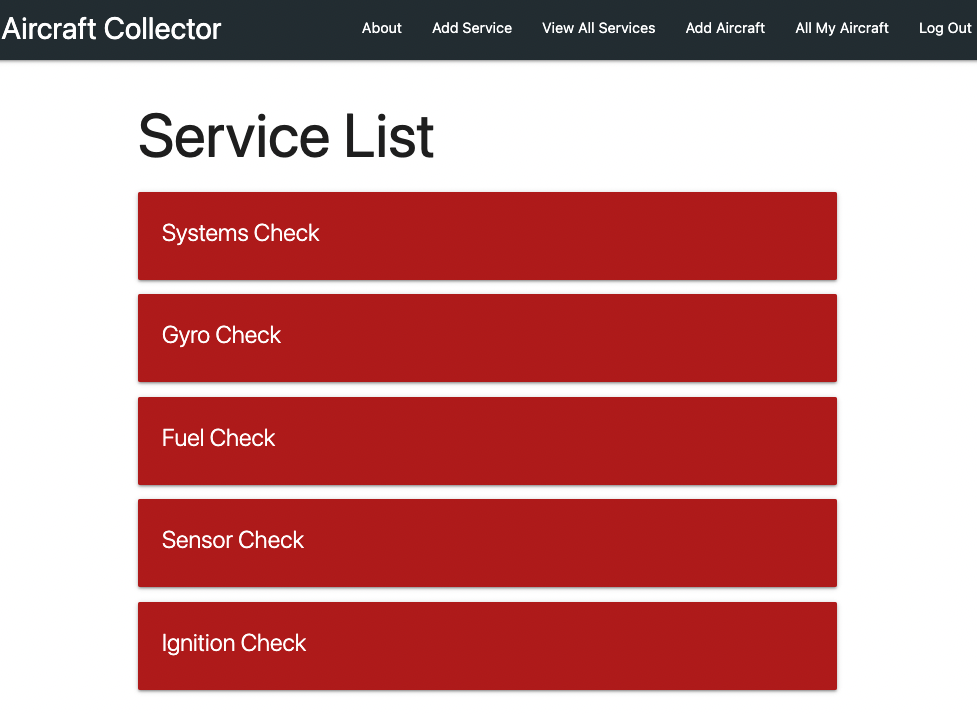

#  Aircraft Collector Application:

### Create your personal Aircraft Collection of planes you love. 

- Aircraft App: https://aircraftcollector.herokuapp.com/
 

This application is meant as an hobbyist tool to add Aircrafts, services, and create a mangement system for viewing them.  

This full-stack CRUD application is based on managing your enthusiam for aircrafts. You begin by using a sign up tool which uses Djang Authentication.You are then able to add your plane, specific services, and more. You can view your aircraft, upload images, manage a fuel system with a built in calendar, and an updated statement appears once you have fueled 3 times in one day. You are also able to create a list of aircrafts, each with different services, and delete as neccesary. In order to access your personal portfolio you must sign in with your personal log in you set up for security and privacy compliance. 

 

#### Technologies used:
> Python
>
> Django
>
> PostgreSQL
>
> AWS S3
>
> DTL Templates
>
> Django Authentication
>
> Javascript
>
> CSS
>
> Materialize 
>

#### Planned Next Steps:
- Add comment system
- Add User interaction by allowing the option to share your airplanes
- Add Video section for airplanes
- Add watchlist system 
- Integrate Global Aviationstack API 
- Enhance styling layout for details, about, and user page 